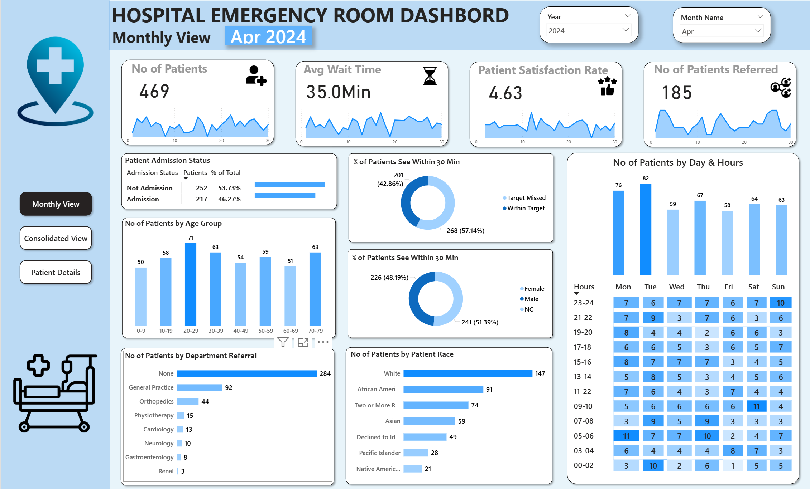

# 🏥 Hospital Emergency Room Dashboard – Power BI Project  

## 📌 Project Overview  
This project showcases an interactive **Hospital Emergency Room (ER) Dashboard** built in **Power BI**.  
The solution empowers healthcare stakeholders to monitor **patient flow, waiting times, satisfaction levels, and referral trends** in real time.  

By leveraging **data modeling, DAX calculations, and compelling visualizations**, the dashboard delivers actionable insights to improve **operational efficiency, patient experience, and resource allocation**.  

---

## 🎯 Business Requirements  
The dashboard addresses critical ER performance metrics:  

- **Number of Patients** – Daily and monthly patient visits with trend analysis.  
- **Average Wait Time** – Time taken before patients are attended to, with daily fluctuations.  
- **Patient Satisfaction Score** – Daily trends to monitor dips in quality of care.  
- **Referrals to Departments** – Patient referrals to specialized departments.  

These KPIs help hospital management **identify bottlenecks, monitor patient care quality, and optimize staff deployment**.  

---

## 📊 Dashboards & Key Features  

### 1️⃣ Monthly View  
- Admitted vs. Non-admitted Patients  
- Patient Age Distribution (10-year intervals)  
- Department Referral Trends  
- Patients Seen Within 30 Minutes (%)  
- Gender & Racial Demographics  
- Daily & Hourly Time Analysis  

### 2️⃣ Consolidated View  
- Holistic view of KPIs across a **custom date range**  
- Aggregated insights for long-term trend analysis  

### 3️⃣ Patient Details  
- Patient-level drill-down with:  
  - Patient ID, Name, Gender, Age  
  - Admission Date & Status  
  - Race, Wait Time, Department Referral  

### 4️⃣ Key Takeaways  
- High-level insights and recommendations generated from the data  

---

## 🛠️ Project Workflow  
The project followed a structured **BI development lifecycle**:  

1. Requirement Gathering & Business Understanding  
2. Data Walkthrough & Connection  
3. Data Cleaning & Quality Checks  
4. Data Modeling & Processing  
5. DAX Calculations for KPIs  
6. Dashboard Layout & Visualization Design  
7. Report Development & Formatting  
8. Insights Generation for Decision-Making  

---

## 🚀 Tech Stack  
- **Power BI** – Data modeling, DAX, and dashboard development  
- **Excel / Database (as source)** – Input data for patient records  
- **Power Query** – Data cleaning & transformation  

---

## 📸 Dashboard Previews  
 

  
*Monthly ER dashboard with admissions, age distribution, and referrals*  

  
*Consolidated ER metrics across date ranges*  

  
*Detailed patient-level analysis for ER visits*  

---

## 📂 Repository Structure  
```plaintext
├── Hospital Dashbord.pbix          # Power BI file
├── README.md                       # Project documentation

